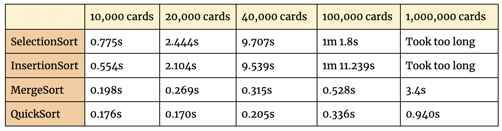

# Authors 
This assignment was completed by Sonora Halili and Frankie Fan. The work spanned thoughout the week. We were in the same code review group and practiced pair-programming for  about 70% of the assignment. We worked on SelectionSort together, Frankie tackled InsertionSort while Sonora did MergeSort and QuickSort.

# Process & Structure 

We followed the recommended progress phases: 

* **Phase 1: Implementing Sorting Algorithms**

  * `SelectionSort.java`: This sorting algorithm uses a ListIterator to locate the smaller element in a pile and then place it in the sorted pile. It took us longer than it should've to make this work without using `get(i)` or any other index-y methods, but once we got a hang of the ListIterator class, we realized it'd be the most efficient way to go about this.

  * `MergeSort.java` : This algorithm places every card of the pile into its own pile and then merges two of these piles at a time, deciding which element should go first (by locating the smaller element in each comparison). We had to add two if conditions on the loop that does this comparison to check if one of the lists have been emptied out.
  * `QuickSort.java` : This algorithm splits the pile into two piles: smaller or bigger than a chosen pivot. It then recursively sorts these two piles, therefore producing a sorted result. We ran into the issue where the program was returning a sorted list that only contained 34 elements, instead of 52. The fix for this issue was returning `unsorted` instead of `result` at the stop condition.

    The visuals of QuickSort got a little complicated as we need the recorder to record the big picture as well as "zoom in" to record every sorting process in the sublist (either smaller or bigger in this case). Considering the priorities of the assignment, we decided to move on to the next phase, leaving the visual this way, since our algorithm works perfectly fine.
  * `InsertionSort.java`: This algorithm picks a card from unsorted and searches for a place in sorted where everything on the left is smaller, and everything in the right is larger than the current card. We implemented this using `get(i)` at first, but then replaced it with `ListIterator`, which came with a few exhausting errors that we fixed via lots of debugging and a simple `break;` statement. 

* **Phase 2: Experimentation** 

Here are the results of the analysis of time spent running the program by the CPU for each of our methods, in seconds, for 10000, 20000, 40000, 100000, and 1000000 cards respectively: 

**Summary of Results:**

From our experimentation, we concluded that the fastest way to sort is using `QuickSort` (amazingly sorted 10^6 cards in less than a second), hence it rightfully named so. A close second is `MergeSort`, which took almost the same time as QuickSort, except it dramatically changed when we tried 10^6 cards, taking 3.4 seconds. `InsertionSort` and `SelectionSort` took similar times, although InsertionSort is preferred since it uses less work to find the position where the card belongs (it doesn't have to parse through the entire pile to locate the smallest one). 

# Classmates & Office Hours: 

* **Emi Neuwalder**: We talked to Emi in class both on Friday and Monday. We both only had pseudocode on Friday, so the vast majority of the help Emi gave us was on Monday. She helped fix an error we had been getting by suggesting that once iterating, we're not allowed to modify the list, but we can modify the iterator which then modifies the list.

* **TA Hours**: 
We attended TA hours on Sunday night and used Glory's help to clearly construct SelectionSort from the beginning. She suggested that using a list iterator would save us so much time and extra work. 

# Resource Exploration 

Besides advice from TAs, professors, and classmates, we used the following resources to help with our assignment: 

* [Java LinkedLists ]([https://www.geeksforgeeks.org/java-program-to-implement-shunting-yard-algorithm/](https://docs.oracle.com/javase/7/docs/api/java/util/LinkedList.html)) : used all throughout the assignment. 
* [Methods of ListIterators]([https://docs.oracle.com/javase/7/docs/api/java/util/Stack.html](https://docs.oracle.com/javase/7/docs/api/java/util/ListIterator.html#previous())) : used all throughout the assignment

# Final Reflection 

Jumping from our own implementation of LinkedLists (which didn't go too well) to using Java's class came with some challenges. We realized we couldn't use `node.next` / `node.previous` without implementing a list iterator, and many of the methods we defined for A6 weren't really available this time. It took us a considerable amount of time to get comfortable with Java LinkedLists, and once we had that down writing the actual sorting methods became easier. After this assignment we have a clear idea of how each algorithm works, and how much it "costs" to use each of them at a given situation.  